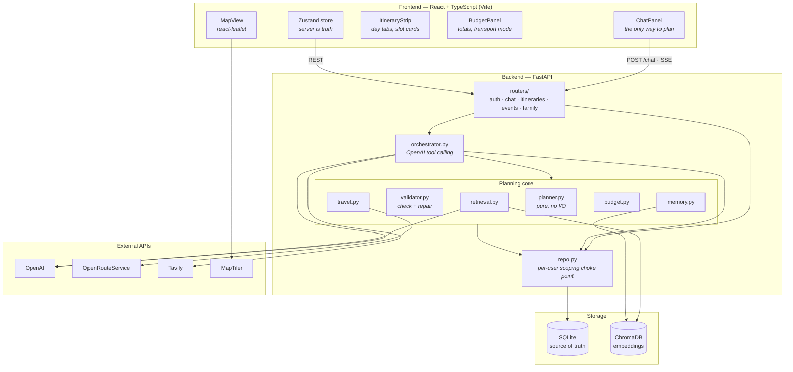
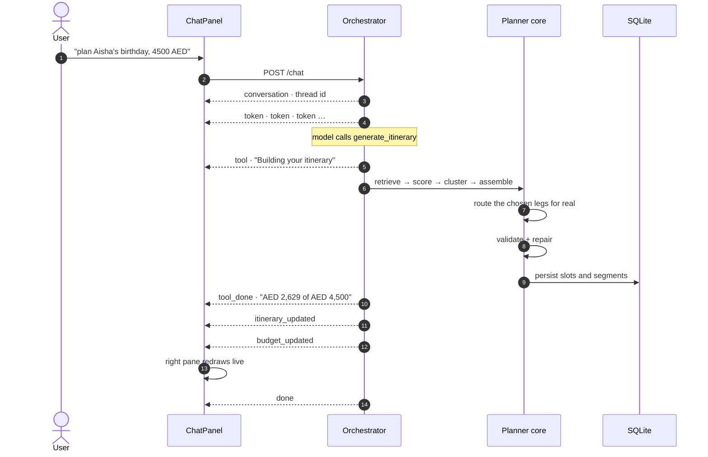
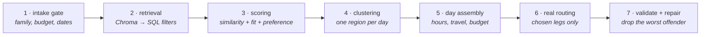
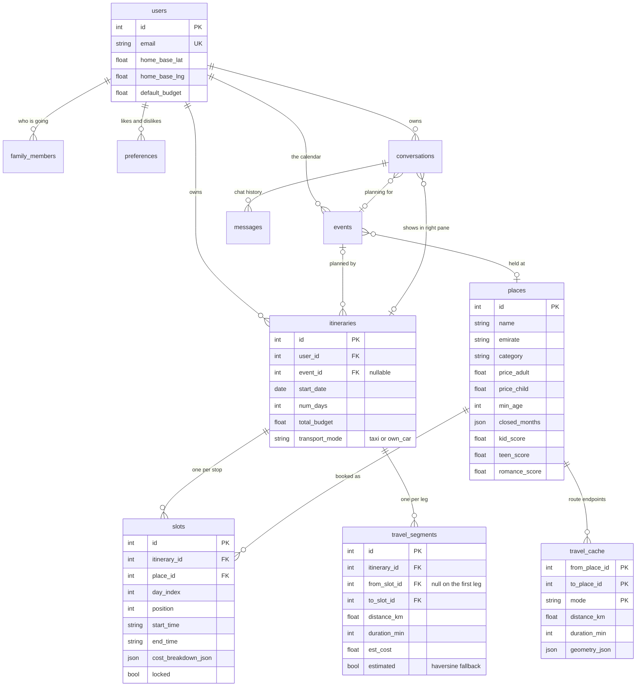

# Rihla — UAE Event-Based Itinerary Planner

Rihla plans complete itineraries (up to 5 days, UAE only) around your upcoming personal events —
a birthday, an anniversary, cousins visiting — with per-user family personalisation, long-term
preference memory, live budget tracking and travel-time-aware scheduling.

**Core principle: the LLM never builds the itinerary.** It reads intent from chat and calls tools;
a deterministic Python planner assembles and validates the schedule. Planning stays correct when
the maps API is down, and the numbers on screen always come from the server.

---

## Quick start

```bash
# 1. Backend
cd backend
python3 -m venv .venv && .venv/bin/pip install -r requirements.txt
cp .env.example .env          # set JWT_SECRET and OPENAI_API_KEY
.venv/bin/python -m app.seed  # 351 places, 2 demo accounts, their events + embeddings
.venv/bin/python -m uvicorn app.main:app --reload    # http://localhost:8000

# 2. Frontend, in a second terminal
cd frontend
npm install
cp .env.example .env          # optional: VITE_MAPTILER_KEY
npm run dev                   # http://localhost:5173
```

Sign in with either demo account — the login screen has one-tap buttons for both:

| Account | Password | Party | Plans skew toward |
|---|---|---|---|
| `demo1@rihla.app` | `demo123` | 2 adults, kids aged 7 and 13 | parks, aquariums, waterparks |
| `demo2@rihla.app` | `demo123` | 2 adults, no children | romantic evenings, fine dining |

The two accounts share nothing — no events, preferences, plans or scoring influence.

---

## Where to get the API keys

Only the first two matter. Everything else degrades to a documented fallback rather than failing.

| Key | Get it from | Free tier | Needed for |
|---|---|---|---|
| **`OPENAI_API_KEY`** | [platform.openai.com/api-keys](https://platform.openai.com/api-keys) | Pay-as-you-go, no free tier | The assistant, place embeddings at seed time |
| **`JWT_SECRET`** | Generate your own: `openssl rand -hex 32` | — | Signing login tokens |
| `ORS_API_KEY` | [openrouteservice.org/dev/#/signup](https://openrouteservice.org/dev/#/signup) | 2,000 requests/day | Real driving times and route geometry |
| `WEB_SEARCH_API_KEY` | [app.tavily.com](https://app.tavily.com) | 1,000 searches/month | Finding one-off live events (concerts, festivals) |
| `LANGSMITH_API_KEY` | [smith.langchain.com](https://smith.langchain.com) → Settings → API Keys | 5,000 traces/month | Tracing LLM and planner calls |
| `VITE_MAPTILER_KEY` | [cloud.maptiler.com/account/keys](https://cloud.maptiler.com/account/keys/) | 100,000 tiles/month | The map's cream-and-teal palette |

### What happens without each one

| Missing | Behaviour |
|---|---|
| `JWT_SECRET` | A dev-only default is used. **Unsafe in production.** |
| `OPENAI_API_KEY` | Seeding fails at the embeddings step. Chat has no scripted fallback — a failed call is reported as an error. |
| `ORS_API_KEY` | Travel times fall back to haversine estimates, drawn as dashed `~35 min` segments. |
| `WEB_SEARCH_API_KEY` | Live event lookup is skipped; seeded data only. |
| `LANGSMITH_API_KEY` | Every tracing decorator becomes a transparent no-op. |
| `VITE_MAPTILER_KEY` | The map falls back to OpenStreetMap tiles under the same CSS palette filter. |

---

## Environment variables

`backend/.env` — see `backend/.env.example`:

```bash
JWT_SECRET=              # required
JWT_EXPIRY_MINUTES=1440

OPENAI_API_KEY=          # required
OPENAI_CHAT_MODEL=gpt-4o-mini
OPENAI_EMBEDDING_MODEL=text-embedding-3-small

ORS_API_KEY=             # optional
WEB_SEARCH_API_KEY=      # optional (Tavily)
LANGSMITH_API_KEY=       # optional

TAXI_AED_PER_KM=2.5      # fare model, see "Travel costs"
FUEL_AED_PER_KM=0.35
PARKING_AED_PER_STOP=15.0

CORS_ORIGINS=http://localhost:5173,http://127.0.0.1:5173
```

`frontend/.env`:

```bash
VITE_MAPTILER_KEY=       # optional
```

---

## System architecture



### How a planning request flows



### The planning pipeline



### Why the LLM is kept out of planning

The model decides **when** to plan and **what was asked for**; it never decides times, prices,
places or totals. Every tool result is recomputed from persisted rows, so a reply cannot quote a
figure that disagrees with the budget bar next to it. Tool schemas use OpenAI **strict mode**, so
arguments are guaranteed to match their shape before a handler ever sees them.

---

## Database design

SQLite is the source of truth. ChromaDB holds only derived vectors — delete it and reseed and
nothing is lost.



### The tables

| Table | Holds | Notes |
|---|---|---|
| `users` | Account, home base coordinates, default currency and budget | Home base is the origin every day starts and ends from |
| `family_members` | One row per person: `role` (adult/child), `age` | Drives scoring weights, pricing tiers and age gates |
| `preferences` | `kind` (like/dislike), `subject`, `category`, `strength` | Written from chat *and* from slot edits |
| `events` | The occasion being planned: type, date, notes | `UNIQUE(user_id, title, date)` makes imports idempotent |
| `places` | 351 venues across all 7 emirates, 12 categories | Prices, opening hours, `closed_months`, kid/teen/romance scores |
| `itineraries` | One plan: dates, budget cap, `transport_mode`, origin | `status`, and a nullable link to the event it serves |
| `slots` | One stop: `day_index`, `position`, times, `cost_breakdown_json` | `locked` protects a slot from repair passes |
| `travel_segments` | One leg between slots: distance, duration, cost, geometry | `estimated` flags a haversine fallback, drawn dashed |
| `travel_cache` | Shared `(from, to, mode)` route lookups | See the note below |
| `conversations` | A chat thread, optionally bound to one itinerary and event | The thread owns what the right pane shows |
| `messages` | Chat history, plus `tool_calls_json` for the activity trace | Last 20 are replayed into the model's context |

### Three design decisions worth knowing

**`travel_cache` caches distance, never price.** Distance between two places is a property of the
road and is shared freely between all users. Price depends on who is travelling and how — a
6-person van costs 1.6× a saloon — so fares are computed at read time from the cached distance. A
cached price would let one party's fare leak into another's plan.

**Costs are stored, not recomputed on read.** `slots.cost_breakdown_json` and
`travel_segments.est_cost` are written when the plan is built, so a price change in the catalog
never silently rewrites a plan someone already saw. Changing transport mode re-prices the stored
legs explicitly, via `POST /itineraries/{id}/transport`.

**There are no migrations.** `create_all()` builds missing tables, and `db.py` carries a short
list of columns added after the fact, applied with an idempotent `ALTER TABLE`. That is a
deliberate trade for a single-column change; if the list grows or anything needs a data backfill,
bring in Alembic.

---

## The assistant's tools

Eleven, all strict-schema, none of which accepts a `user_id` — the model cannot address another
user however it is prompted.

| Tool | Does |
|---|---|
| `save_family_details` | Record who is in the family and what they like |
| `create_event` | Add an event to the calendar |
| `get_upcoming_events` | Look further ahead than the calendar already in context |
| `find_live_events` | Search the web for concerts and festivals — **read-only, saves nothing** |
| `generate_itinerary` | Build a plan. `focus` = `full_day` or `dinner_only`; `adults_only` for a couple's night |
| `get_itinerary` | Read a plan's current state before describing it |
| `make_day_cheaper` | Re-solve one day against a smaller budget; reports what it actually saved |
| `add_prayer_breaks` | Insert prayer breaks and reflow the day |
| `set_transport` | Switch between taxi fares and driving yourself, and re-price |
| `edit_stop` | Remove a stop, or move it to a different time |
| `record_preference` | Note a like or dislike mentioned in passing |

The user's calendar, family and preferences are **injected into the system prompt**, not fetched —
so the assistant never asks for a date it already has.

---

## How the planner decides

**Geography.** Days are clustered by farthest-point seeding so one day does not zig-zag between
emirates. Within a day, a stop more than **60 km** from the previous one is rejected outright — a
soft distance penalty ranks, but only a hard cap stops a thin candidate pool producing a dinner in
the next emirate.

**Meals are measured by detour, not distance.** A restaurant is scored on what it *adds* to the
journey you were already making: `d(here → restaurant) + d(restaurant → next) − d(here → next)`,
where "next" is the following attraction if one is still ahead, and home if none is. One on the
way costs zero.

**Restaurants may repeat, attractions may not.** A good restaurant on a road you are already
driving is worth returning to; seeing the same aquarium twice is not a trip. A repeat needs a
detour under 10 km, and loses ties to somewhere new.

**Travel costs** scale with party size, because five people need a bigger vehicle:

| Party | Vehicle | Multiplier |
|---|---|---|
| ≤ 4 | standard | ×1.0 |
| 5–6 | 6-seater | ×1.6 |
| 7+ | two vehicles | ×2.0 |

Taxi is `km × 2.50 × multiplier`. Own car is `km × 0.35 × multiplier + 15 per stop` for parking.

---

## API reference

| Method | Path | Purpose |
|---|---|---|
| `POST` | `/auth/register`, `/auth/login` | Returns a JWT |
| `GET` | `/me` | Current user |
| `GET` `PUT` | `/family` | Read / replace the family |
| `GET` `POST` `DELETE` | `/preferences` | Likes and dislikes |
| `GET` `POST` `DELETE` | `/events` | The calendar |
| `POST` | `/chat` | SSE stream — the only way to plan |
| `GET` `POST` | `/conversations`, `/{id}/messages`, `/{id}/seen` | Threads |
| `POST` | `/itineraries/generate` | Build a plan directly |
| `GET` | `/itineraries/{id}` | The full plan the workspace renders |
| `GET` | `/itineraries/{id}/slots/{slot_id}/alternatives` | Three swaps that fit the window |
| `PATCH` | `/itineraries/{id}/slots/{slot_id}` | Replace / adjust / remove one slot |
| `POST` | `/itineraries/{id}/days/{n}/cheaper` | Re-solve one day cheaper |
| `POST` | `/itineraries/{id}/prayer-breaks` | Insert prayer breaks |
| `POST` | `/itineraries/{id}/transport` | `taxi` or `own_car`, re-prices in place |

Interactive docs at `http://localhost:8000/docs` while the server is running.

---

## Testing

```bash
cd backend && .venv/bin/python -m pytest    # 288 tests, ~70s (the model is stubbed)
cd frontend && npm run build                # tsc + vite
```

No test ever makes a billable API call. Coverage includes the scheduler (overlaps, budget caps,
opening hours, venues open past midnight, age gates, meal placement, the 60 km hop cap, detour
scoring, restaurant revisits), the travel provider (cache hit, timeout → haversine, fare tiers,
transport modes), slot patching, per-user isolation, the web search adapter, strict tool schemas,
and eight Hypothesis properties.

---

## CLI: seeding one user's events

Separate from the global bootstrap, for demo prep or bulk-loading a calendar:

```bash
# From a JSON file
python -m app.seed_events --user demo2@rihla.app --file anniversary_events.json

# Or a single event inline
python -m app.seed_events --user demo1@rihla.app \
    --title "School winter break trip" --type family_visit \
    --date 2026-12-14 --notes "5 days, whole family"
```

Resolves `--user` by email and **exits non-zero before any write** if it does not exist — it never
creates users. Validates the whole batch before inserting the first row, so a bad entry halfway
down a file cannot leave a half-applied import. Idempotent on `(user_id, title, date)`, reporting
`inserted: N, skipped: M`.

---

## Known limits

- **The map is real geography, not the illustration.** MapTiler's `basic-v2` tiles are recoloured
  toward the design's cream and teal, but tiles cannot reproduce hand-drawn road ribbons.
- **Seasonal closures are modelled, not flagged.** Seventeen venues carry `closed_months` — Global
  Village runs October to April — and the planner will not schedule into them.
- **Some coordinates are unroutable.** ORS returns 404 for a few beach and island points with no
  road access; those legs fall back to dashed estimates by design.
- **Prayer times are approximate.** A static monthly UAE table, accurate to roughly ±10 minutes,
  well inside the slack of a 20-minute gap. `services/prayer.py` documents the upgrade path.
- **Place photos are placeholders.** `image_url` seeds as `null` and cards render a per-category
  illustration, so a card can never show a broken image.
- **The trip home is not costed.** A day's travel total covers the legs between stops, not the
  drive back from the last one.
- **"The best restaurant" is not a concept.** Scoring weights cuisine preference above romance,
  and price only ever constrains — it never attracts — so "budget is no issue" does not make an
  expensive venue win.
- **Web search needs both keys.** Tavily finds the pages; pulling an event name out of scraped
  page chrome needs comprehension, so without `OPENAI_API_KEY` the adapter returns nothing rather
  than feeding the planner noise.
